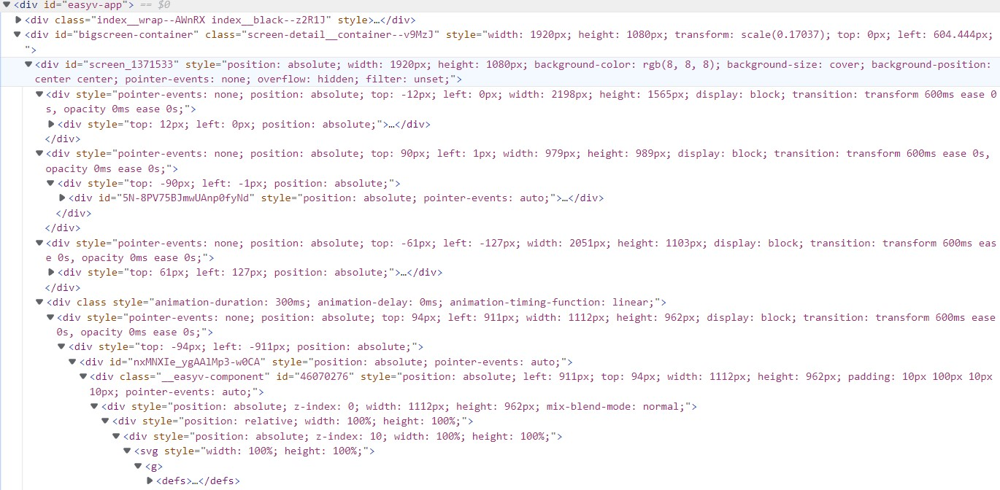

# Vapp

## 技术栈
React + TypeScript + Vite + Redex + Axios
使用的包管理工具是pnpm

## 出发理念
市面上的底代码工具使用起来的体验对于设计人员是可以轻易上手的
但就是因为这个缘由导致大部分的底代码工具都是封装成组件然后拖拽放置页面
其实在代码层面上全部都是**绝对定位**，这对于程序员来进行后期维护可以说是一个非常恐怖😱的事情
所以该底代码项目出发点就是基于日常程序员写代码的逻辑构建页面，这可以使得程序员在后期维护时也可以
轻松的认清**代码结构**，而不是被一堆绝对定位糊脸，打开一个最外层的div发现所有元素放在同一个层级

我相信这样不知所以的各种嵌套是所有程序员都不愿意面对的

## 设计思路
这个程序的设计思路的核心之一就是**虚拟dom**，在这一块的认知其实是来自Vue3，又因为是对标小程序代码所以
我将这个项目命名为**Vapp**，当用户拖拽构建页面的时候项目的虚拟机就会把页面构建成一个虚拟dom，在用户点击下载按钮
的时候，会将虚拟dom发送到后端处理然后返回一个压缩包